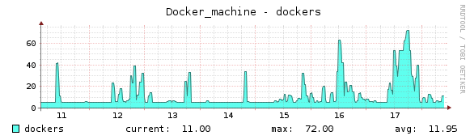

# Runners autoscale configuration

> Autoscale feature was introduced in version `1.1.0`.

## Overview

Autoscale provides a possibility to utilise resources in more elastic and more dynamic way.

When feature is enabled and configured properly, builds are executed on machines created
*on demand*. Those machines, after the build is finished, can wait to run next builds or can
be removed after configured *idle time*. In case of many cloud providers this helps to
utilise the cost of used instances.

Thanks to runners autoscale, Your infrastructure contains only as much build instances
as is necessary at anytime.

Real life example of runners autoscale feature, tested on GitLab.com for
*GitLab Community Edition* project:



Each machine on the chart is a independent cloud instance, running build jobs inside
of docker containers.

## Autoscaling algorithm and parameters

Autoscaling algorithm is based on three main parameters: *IdleCount*, *IdleTime* and *limit*.

Each machine, which actually does not run a build, is in *Idle* state. GitLab Runner
in autoscale mode monitors all machines and ensures, that there is always an *IdleCount*
of machines in *Idle* state.

At the same time GitLab Runner is checking the duration of the *Idle* state of each
machine. If the time exceeds *IdleTime* value, the machine is removed.

**Example**

Let's suppose, that we have configured GitLab Runner with following autoscale parameters:

```
[[runners]]
  limit = 10
  (...)
  executor = "docker+machine"
  [runners.machine]
    IdleCount = 2
    IdleTime = 1800
    (...)
```

At the beginning, when no builds are queued, GitLab Runner starts two machines (*IdleCount = 2*),
and sets them in the *Idle* state. After half of hour (*IdleTime = 1800*) both machines are
removed. At this moment we have **zero** machines in *Idle* state, so GitLab Runner starts a new
two machines.

After this, **five** builds are queued in the GitLab CI. First two builds are send to the *Idle*
machines. At this moment GitLab Runner notices that the number of *Idle* machines is less than
*IdleCount*, so it starts a new two machines. After this next two builds from queue are sent
to those machines. Again - number of *Idle* machines is less than *IdleCount*, GitLab Runner
starts a new two machines. Last queued build is sent to one of the *Idle* machines.

At this moment we have **one** *Idle* machine, so GitLab Runner starts **one** new machine.
Because there is no new builds in queue, those two machines stay in *Idle* state, and GitLab
Runner is satisfied.

**What happend?**

We had **two** machines, waiting in *Idle* state for new builds. After **five** builds where
queued, new machines were created, and after that we have now **seven** machines. **Five** of
them are running builds, and **two** are in *Idle* state, waiting for next builds.

The algorithm will still work in the same way - GitLab Runner will create new *Idle* machine
for each machine used for build execution. Those machines will be created up to the number
defined by *limit* parameter. If GitLab Runner notices, that there is *limit* number of created
machines, it will stop autoscaling, and new builds will need to wait in build queue until machines
will start returning to *Idle* state.

**Scaling down**

After build is finished, the machine is set to *Idle* state and is waiting for next builds to
be executed. Let's suppose, that we have no new builds in queue. After time designated by *IdleTime*
*Idle* machines will be removed. In our example, after half of hour all machines will be removed
(each machine after half of hour from when last build execution ended) and GitLab Runner will start
to keep an *IdleCount* of *Idle* machines running, just like at the beginning of the example.

A comp chart of builds statuses and machines statuses in time:


## System requirements

To use autoscale feature, system must have:

- GitLab Runner executable - installation guide can be found in [GitLab Runner Documentation][runner-installation]
- Docker Machine executable - installation guide can be found in [Docker Machine documentation][docker-machine-installation]

If autoscale need to use virtualization/cloud providers that aren't handled by Docker Machine
internal drivers, the appropriate driver plugin must be installed. Docker Machine driver
plugin installation and configuration is out of scope of this docummentation. For more details
please read [Docker Machine documentation][docker-machine-docs].

## Runner configuration

In this section will be discribed only parameters significant from the autoscale feature point
of view. For more configurations details please read [GitLab Runner - Installation][runner-installation]
and [GitLab Runner - Advanced Configuration][runner-configuration].

**Global**

| Parameter    | Value   | Description |
|--------------|---------|-------------|
| `concurrent` | integer | Limits how many jobs globally can be run concurrently. The most upper limit of jobs using all defined runners. Together with `limit` (from **[runners]** section) and `IdleCount` (from **[runners.machine]** section) it affects the upper limit of created machines. |

**runners**

| Parameter  | Value            | Description |
|------------|------------------|------------------|
| `executor` | string           | To use autoscale feature must be set to `docker+machine` or `docker-ssh+machine`. |
| `limit`    | integer          | Limits how many jobs can be handled concurrently by this token. 0 simply means don't limit. For autoscale it's the upper limit of machines created by this provider (with complicity of `concurrent` and `IdleCount`). |

**runners.machine**

| Parameter        | Value            | Description |
|------------------|------------------|-------------|
| `IdleCount`      | integer          | Number of machines, that need to be created and waiting in *Idle* state. |
| `IdleTime`       | integer          | Time (in seconds) for machine to be in *Idle* state before it is removed. |
| `MaxBuilds`      | integer          | Builds count after which machine will be removed. |
| `MachineName`    | string           | Name of the machine. It must contain `%s`. The `%s` will be replaced with unique machine identifier. |
| `MachineDriver`  | string           | Docker Machine `driver` to use. More details can be found in [Docker Machine configuration section](#docker-machine-configuration). |
| `MachineOptions` | array of strings | Docker Machine options. More details can be found in [Docker Machine configuration section](#docker-machine-configuration). |

**Example of config.toml**

```toml
concurrent = 50

[[runners]]
  url = "https://gitlab.com/ci"
  token = "RUNNER_TOKEN"
  name = "autoscale-runner"
  executor = "docker+machine"
  limit = 10
  [runners.docker]
    image = "ruby:2.1"
  [runners.machine]
    IdleCount = 5
    IdleTime = 600
    MaxBuilds = 100
    MachineName = "auto-scale-%s"
    MachineDriver = "digitalocean"
    MachineOptions = [
        "digitalocean-image=coreos-beta",
        "digitalocean-ssh-user=core",
        "digitalocean-access-token=DO_ACCESS_TOKEN",
        "digitalocean-region=nyc2",
        "digitalocean-size=4gb",
        "digitalocean-private-networking",
        "engine-registry-mirror=http://10.128.11.79:34723"
    ]
```

This config assumes, that:

- runner is using `docker+machine` executor,
- runner can execute up to 10 builds (created machines),
- default image used for builds is `ruby:2.1`,
- there must be **5** machines in *Idle* state,
- each machine can be in *Idle* state up to **600** seconds (after this it will be removed),
- each machine can handle up to **100** builds (after this it will be removed),
- Docker Machine uses `digitalocean` driver.

`MachineOptions` parameter contains options for `digitalocean driver` used by Docker Machine,
and one option for Docker Machine itself (`engine-registry-mirror`).

**Additional informations**

There is also a special mode, where `IdleCount = 0`. In this mode machines are **always** created
**on-demand** before build (if there is no available machine in *Idle* state). After the build autoscaling
algorithm works the same as it was wrote above. Machine is waiting for next builds, and if no one
is executed - after the `IdleTime` time period - the machine is removed. If there is no builds - we
have no machines in *Idle* state.

**How `current`, `limit` and `IdleCount` generate the upper limit of running machines**

**Example 1:**

```toml
concurrent=20

[[runners]]
limit=40
[[runners.machine]]
IdleCount=10
```

In the worst case scenario we will have 30 machines: 20, because this is how many builds can be
run concurrently and 10 extra, because we want to fulfil the docker+machine policy to have
at least 10 idle machines.

**Example 2:**

```toml
concurrent=20

[[runners]]
limit=25
[[runners.machine]]
IdleCount=10
```

In this example we will have at most 20 concurrent builds, and at most 25 machines created.
In the worst case we will not be able to have 10 idle machines, but only 5, because of the limit.

## Docker Machine configuration

Autoscale mechanism currently is based on *Docker Machine*. Advanced configuration options,
including virtualization/cloud provider parameters, are available at [Docker Machine documentation][docker-machine-docs].


[runner-installation]: https://gitlab.com/gitlab-org/gitlab-ci-multi-runner#installation
[runner-configuration]: https://gitlab.com/gitlab-org/gitlab-ci-multi-runner#advanced-configuration
[docker-machine-docs]: https://docs.docker.com/machine/
[docker-machine-installation]: https://docs.docker.com/machine/install-machine/
