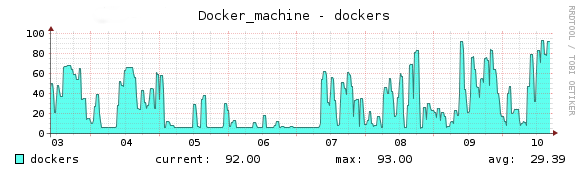
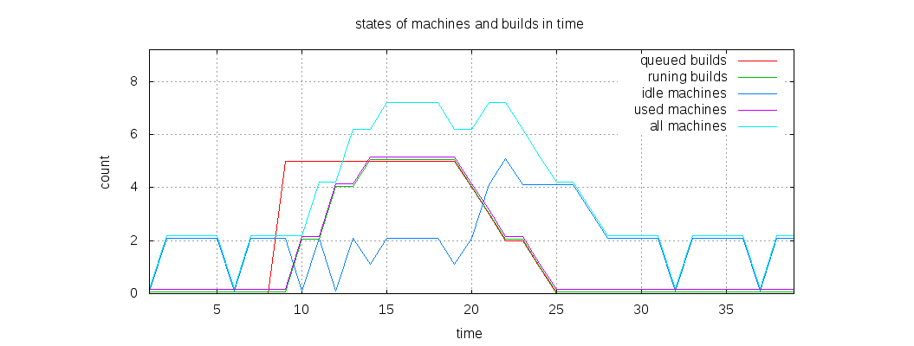

# Runners autoscale configuration

> The autoscale feature was introduced in GitLab Runner 1.1.0.

## Overview

Autoscale provides the ability to utilize resources in a more elastic and
dynamic way.

When this feature is enabled and configured properly, builds are executed on
machines created _on demand_. Those machines, after the build is finished, can
wait to run the next builds or can be removed after the configured `IdleTime`.
In case of many cloud providers this helps to utilize the cost of already used
instances.

Thanks to runners being able to autoscale, your infrastructure contains only as
much build instances as necessary at anytime. If you configure the Runner to
only use autoscale, the system on which the Runner is installed acts as a
bastion for all the machines it creates.

Below, you can see a real life example of the runners autoscale feature, tested
on GitLab.com for the [GitLab Community Edition][ce] project:



Each machine on the chart is an independent cloud instance, running build jobs
inside of Docker containers.

[ce]: https://gitlab.com/gitlab-org/gitlab-ce

## Autoscaling algorithm and parameters

The autoscaling algorithm is based on three main parameters: `IdleCount`,
`IdleTime` and `limit`.

We say that each machine that does not run a build is in _Idle_ state. When
GitLab Runner is in autoscale mode, it monitors all machines and ensures that
there is always an `IdleCount` of machines in _Idle_ state.

At the same time, GitLab Runner is checking the duration of the _Idle_ state of
each machine. If the time exceeds the `IdleTime` value, the machine is
automatically removed.

---

**Example:**
Let's suppose, that we have configured GitLab Runner with the following
autoscale parameters:

```bash
[[runners]]
  limit = 10
  (...)
  executor = "docker+machine"
  [runners.machine]
    IdleCount = 2
    IdleTime = 1800
    (...)
```

At the beginning, when no builds are queued, GitLab Runner starts two machines
(`IdleCount = 2`), and sets them in _Idle_ state. After 30 minutes
(`IdleTime = 1800`), both machines are removed. As of this moment we have
**zero** machines in _Idle_ state, so GitLab Runner starts 2 new machines to
satisfy `IdleCount` which is set to 2.

Now, let's assume that 5 builds are queued in GitLab CI. The first 2 builds are
sent to the _Idle_ machines. GitLab Runner notices that the number of _Idle_
machines is less than `IdleCount` (`0 < 2`), so it starts 2 new machines. Then,
the next 2 builds from the queue are sent to those newly created machines.
Again, the number of _Idle_ machines is less than `IdleCount`, so GitLab Runner
starts 2 new machines and the last queued build is sent to one of the _Idle_
machines.

We now have 1 _Idle_ machine, so GitLab Runner starts another 1 new machine to
satisfy `IdleCount`. Because there are no new builds in queue, those two
machines stay in _Idle_ state and GitLab Runner is satisfied.

---

**This is what happend:**
We had 2 machines, waiting in _Idle_ state for new builds. After the 5 builds
where queued, new machines were created, so in total we had 7 machines. Five of
them were running builds, and 2 were in _Idle_ state, waiting for the next
builds.

The algorithm will still work in the same way; GitLab Runner will create a new
_Idle_ machine for each machine used for the build execution. Those machines
will be created up to the number defined by `limit` parameter. If GitLab Runner
notices that there is a `limit` number of total created machines, it will stop
autoscaling, and new builds will need to wait in the build queue until machines
start returning to _Idle_ state.

---

**Scaling down:**
After the build is finished, the machine is set to _Idle_ state and is waiting
for the next builds to be executed. Let's suppose that we have no new builds in
the queue. After the time designated by `IdleTime` passes, the _Idle_ machines
will be removed. In our example, after 30 minutes, all machines will be removed
(each machine after 30 minutes from when last build execution ended) and GitLab
Runner will start to keep an `IdleCount` of _Idle_ machines running, just like
at the beginning of the example.

Below you can see a comparison chart of builds statuses and machines statuses
in time:



## System requirements

To use the autoscale feature, the system which will host the Runner must have:

- GitLab Runner executable - installation guide can be found in
  [GitLab Runner Documentation][runner-installation]
- Docker Machine executable - installation guide can be found in
  [Docker Machine documentation][docker-machine-installation]

If you need to use any virtualization/cloud providers that aren't handled by
Docker's Machine internal drivers, the appropriate driver plugin must be
installed. The Docker Machine driver plugin installation and configuration is
out of the scope of this documentation. For more details please read the
[Docker Machine documentation][docker-machine-docs].

## Distributed runners caching

To speed up your builds, GitLab Runner provides a [cache mechanism][cache]
where selected directories and/or files are saved and shared between subsequent
builds.

This is working fine when builds are run on the same host, but when you start
using the Runners autoscale feature, most of your builds will be running on a
new (or almost new) host, which will execute each build in a new Docker
container. In that case, you will not be able to take advantage of the cache
feature.

To overcome this issue, together with the autoscale feature, the distributed
Runners cache feature was introduced.

It uses any S3-compatible server to share the cache between used Docker hosts.
When restoring and archiving the cache, GitLab Runner will query the S3 server
and will download or upload the archive.

To enable distributed caching, you have to define it in `config.toml` using the
[`[runners.cache]` directive][runners-cache]:

```bash
[[runners]]
  limit = 10
  executor = "docker+machine"
  [runners.cache]
    Type = "s3"
    ServerAddress = "s3.example.com"
    AccessKey = "access-key"
    SecretKey = "secret-key"
    BucketName = "runner"
    Insecure = false
```

## Distributed docker registry mirroring

To speed up builds executed inside of docker containers you can use docker registry mirroring
service. It will provide a proxy between your docker machines and all used registries. Images
will be downloaded once by the registry mirror. On each new host, or on another existing host
where such image is not available, it will be downloaded from configured registry mirror.

Since the mirror will exist - mostly - in your docker machines LAN, the image downloading
step should be much faster on each host.

To configure docker registry mirroring you have to add a `MachineOption` to the configuration
in `config.toml`:

```bash
  [runners.machine]
    (...)
    MachineOptions = [
      (...)
      "engine-registry-mirror=http://10.11.12.13:12345"
    ]
```

Where `10.11.12.13:12345` is an address and port where your registry mirror is listening
for connections from docker service. It must be accessible for each host created by the
Docker Machine.

## Runner configuration

In this section will be discribed only parameters significant from the autoscale feature point
of view. For more configurations details please read [GitLab Runner - Installation][runner-installation]
and [GitLab Runner - Advanced Configuration][runner-configuration].

**global**

| Parameter    | Value   | Description |
|--------------|---------|-------------|
| `concurrent` | integer | Limits how many jobs globally can be run concurrently. The most upper limit of jobs using all defined runners. Together with `limit` (from **[runners]** section) and `IdleCount` (from **[runners.machine]** section) it affects the upper limit of created machines. |

**[[runners]]**

| Parameter  | Value            | Description |
|------------|------------------|-------------|
| `executor` | string           | To use autoscale feature must be set to `docker+machine` or `docker-ssh+machine`. |
| `limit`    | integer          | Limits how many jobs can be handled concurrently by this token. 0 simply means don't limit. For autoscale it's the upper limit of machines created by this provider (with complicity of `concurrent` and `IdleCount`). |

**[runners.machine]**

Configuration parameters details can be found
in [GitLab Runner - Advanced Configuration - The runners.machine section](advanced-configuration.md#the-runnersmachine-section).

**[runners.cache]**

Configuration parameters details can be found
in [GitLab Runner - Advanced Configuration - The runners.cache section](advanced-configuration.md#the-runnerscache-section)

**Example of config.toml**

```bash
concurrent = 50

[[runners]]
  url = "https://gitlab.com/ci"
  token = "RUNNER_TOKEN"
  name = "autoscale-runner"
  executor = "docker+machine"
  limit = 10
  [runners.docker]
    image = "ruby:2.1"
  [runners.machine]
    IdleCount = 5
    IdleTime = 600
    MaxBuilds = 100
    MachineName = "auto-scale-%s"
    MachineDriver = "digitalocean"
    MachineOptions = [
        "digitalocean-image=coreos-beta",
        "digitalocean-ssh-user=core",
        "digitalocean-access-token=DO_ACCESS_TOKEN",
        "digitalocean-region=nyc2",
        "digitalocean-size=4gb",
        "digitalocean-private-networking",
        "engine-registry-mirror=http://10.11.12.13:12345"
    ]
  [runners.cache]
    Type = "s3"
    ServerAddress = "s3-eu-west-1.amazonaws.com"
    AccessKey = "AMAZON_S3_ACCESS_KEY"
    SecretKey = "AMAZON_S3_SECRET_KEY"
    BucketName = "runners"
    Insecure = false
```

This config assumes, that:

- runner is using `docker+machine` executor,
- runner can execute up to 10 builds (created machines),
- default image used for builds is `ruby:2.1`,
- there must be **5** machines in _Idle_ state,
- each machine can be in _Idle_ state up to **600** seconds (after this it will be removed),
- each machine can handle up to **100** builds (after this it will be removed),
- Docker Machine is using `digitalocean` driver,
- Docker Machine is using registry mirroring, with mirror service available at `http://10.11.12.13:12345`,
- runner is using distributed cache with Amazon S3 service.

`MachineOptions` parameter contains options for `digitalocean driver` used by Docker Machine,
and one option for Docker Machine itself (`engine-registry-mirror`).

**Additional informations**

There is also a special mode, where `IdleCount = 0`. In this mode machines are **always** created
**on-demand** before build (if there is no available machine in _Idle_ state). After the build autoscaling
algorithm works the same as it was wrote above. Machine is waiting for next builds, and if no one
is executed - after the `IdleTime` time period - the machine is removed. If there is no builds - we
have no machines in _Idle_ state.

**How `current`, `limit` and `IdleCount` generate the upper limit of running machines**

**Example 1:**

```bash
concurrent=20

[[runners]]
limit=40
[[runners.machine]]
IdleCount=10
```

In the worst case scenario we will have 30 machines: 20, because this is how many builds can be
run concurrently and 10 extra, because we want to fulfil the docker+machine policy to have
at least 10 idle machines.

**Example 2:**

```bash
concurrent=20

[[runners]]
limit=25
[[runners.machine]]
IdleCount=10
```

In this example we will have at most 20 concurrent builds, and at most 25 machines created.
In the worst case we will not be able to have 10 idle machines, but only 5, because of the limit.

## Docker Machine configuration

Autoscale mechanism currently is based on *Docker Machine*. Advanced configuration options,
including virtualization/cloud provider parameters, are available at [Docker Machine documentation][docker-machine-docs].

[cache]: http://doc.gitlab.com/ce/ci/yaml/README.html#cache
[runner-installation]: https://gitlab.com/gitlab-org/gitlab-ci-multi-runner#installation
[runner-configuration]: https://gitlab.com/gitlab-org/gitlab-ci-multi-runner#advanced-configuration
[docker-machine-docs]: https://docs.docker.com/machine/
[docker-machine-installation]: https://docs.docker.com/machine/install-machine/
[runners-cache]: advanced-configuration.md#the-runnerscache-section
